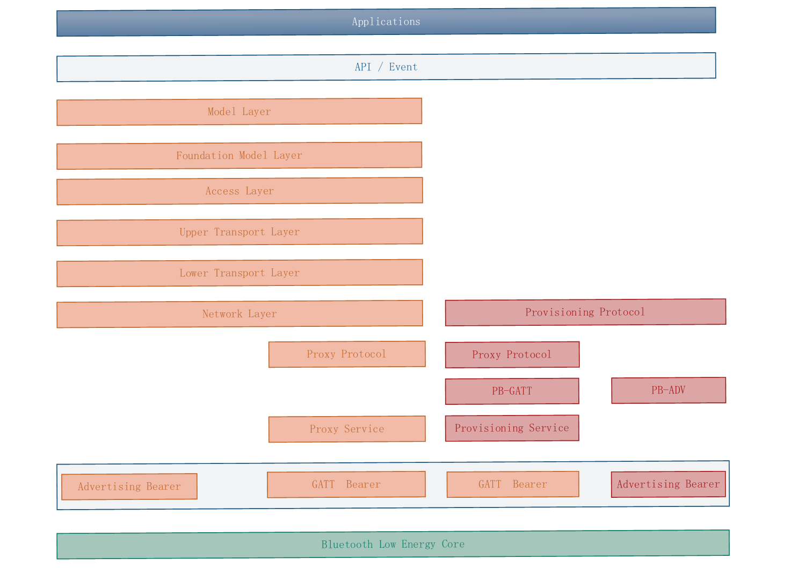
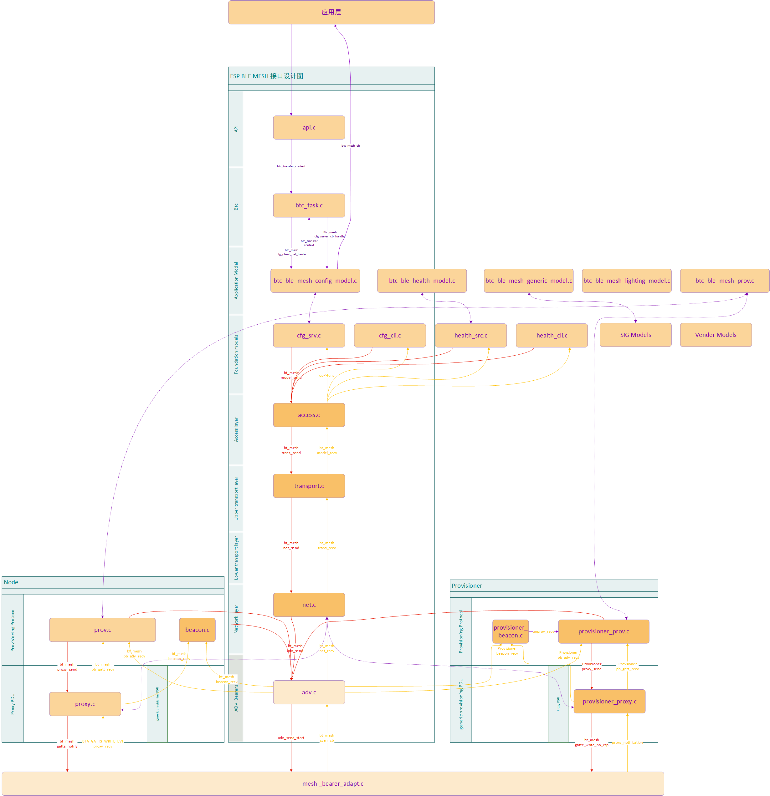

# ESP BLE Mesh 协议栈
ESP BLE Mesh 协议栈是对 [Mesh Profile]() 的实现。本文将从协议栈框架、协议栈实现及辅助程序三个方面介绍 ESP BLE Mesh 协议栈。
* ESP BLE Mesh 协议栈框架
   * ESP BLE Mesh 协议栈框架是将 Mesh Profile 描述的各个部分进行组成一个整体，且 ESP BLE Mesh 协议栈框架中每个模块都能在 Mesh Profile 找到具体描述。
* ESP BLE Mesh 协议栈实现
   * 此章节从文件的基本功能、文件与协议栈框架的对应关系、文件与文件调用的接口关系三个方面讲述了 ESP BLE Mesh 协议栈代码文件。
* ESP BLE Mesh 辅助程序
   * 讲述了 ESP BLE Mesh 协议栈的辅助程序，比如 Mesh 网络管理，Mesh feature等。
	
## 1. 协议栈框架

ESP BLE Mesh 协议栈实现了 [Mesh Profile]() 的所有功能，并通过了蓝牙官方[认证]()，ESP BLE Mesh 协议栈框架如图 1.1 所示：

                                             
图 1.1 协议栈框架图
                     

ESP BLE MESH 协议栈主体由`Mesh Networking`(黄色框图)，`Mesh Provisioning`(红色框图) 和 `Applications`(蓝色框图) 组成。
   * Mesh Networking 负责 Node 以及 Provisioner 的网络消息处理等。
   * Mesh Provisioning负责 Node 以及Provisioner 的启动配置流程。
   * `Applications`通过调用 API 和处理 Event 的方式和协议栈中的 `Mesh Networking` 与 `Mesh Provisioning` 进行交互。

* ESP BLE Mesh 协议栈建立在低功耗蓝牙技术之上,通过承载层使用低功耗蓝牙的广播以及连接通道进行数据交互，其中 承载层包括 `Advertising Bearer` 和 `GATT  Bearer` 。

ESP BLE Mesh 协议栈是采用分层的方式进行设计的，数据包的处理会经过的层处理顺序是固定的，也就是数据包的处理过程会形成一个`消息流`[(message flow)]()。
* 从框架图上可以知道主要有 4 种类型的[`消息流`]()
* 其中每一层对数据包都会进行不同的处理
	* `Network Layer`会对网络数据包进行模糊化/去模糊化, 加密/解密等； 
	* Lower Transport Layer`会对数据包进行分包和重组； 
	* Upper Transport Layer`会对数据包进行应用层的加密解密等。

### 1.1 Mesh Networking

 协议栈框架图中的 `Mesh Networking` 实现了如下
 * 实现了 Mesh 网络中的成员之间( Node，provisioner )的通讯。
 * 实现了 Mesh 网络中的消息的加密解密。
 * 实现了 Mesh 网络资源的管理。
 * 实现了 Mesh 消息的分包与重组。
 * 实现了 Mesh 的节点特性(lpn,friend...)
 * 更多功能，请见[链接]()

 `Mesh Networking`功能的实现是基于层次结构的，共有 7 层组成，每一层的功能如下表所示：

| Layer     | Function |
| --------- | -------- |
| 模型（Model Layer）| 模型层与模型等的实施、以及诸如行为、消息、状态等的实施有关。|
| 基础模型（foundation model Layer）| 基础模型层负责实现与mesh网络配置和管理相关的模型。|
| 接入层（Access Layer）| 接入层主要负责应用数据的格式、定义并控制上层传输层对数据包的加密和解密等。|
| 上层传输层（upper transport Layer）| 负责对接入层进出的应用数据进行加密、解密和认证。它还负责称为“传输控制消息”（transport control messages）这一特殊的消息，包括与“friendship”相关的心跳和消息。 |
| 底层传输层（lower transport layer）| 在需要之时，底层传输层能够处理PDU的分段和重组。 |
| 网络层（network layer） | 网络层定义了各种消息地址类型和网络消息格式。中继和代理行为通过网络层实施。 |
| 广播承载层 (Advertising Bearer) | When using the advertising bearer, a mesh packet shall be sent in the Advertising Data of a `Bluetooth Low Energy advertising PDU` using the Mesh Message AD Type |
| 代理协议 (Proxy Protocol)     | The proxy protocol enables nodes to send and receive Network PDUs, mesh beacons, proxy configuration messages and Provisioning PDUs over a connection-oriented bearer. |
| GATT承载层 (GATT Bearer) | The GATT bearer uses the Proxy protocol to transmit and receive `Proxy PDUs` between two devices over a GATT connection |
| 代理服务 (Proxy Service) | The Mesh Proxy Service is used to enable a server to send and receive Proxy PDUs with a client. |

**Note：承载层（bearer layer）定义了如何使用底层低功耗协议传输 BLE Mesh 数据包，目前定义了广播承载层（Advertising Bearer）和 GATT 承载层。**
* GATT 承载层由 `GATT Bearer`，`Proxy Service`,`Proxy Protocol`组成
* 广播承载层由 Advertising Bearer 组成。

### 1.2 Mesh Provisioning

协议栈框架图中的 `Mesh Provisioning` 实现了如下功能：
 * 实现了 Mesh 网络的组建
 * 实现了对设备的配置
 * 实现了 Mesh 网络资源的分配(单播地址，Iv index，NetKey)。
 * 更多功能，请见[链接]()
 
`Mesh Provisioning`功能的实现是基于层次结构的，协议栈框架图中的 `Mesh Provisioning` 每一层的具体功能如下表所示：

| Layer     | Function |
| --------- | -------  |
| 配置协议（Provisioning Protocol）| Provisioning is a process of adding an unprovisioned device to a mesh network, managed by a Provisioner. |
| 代理协议 (Proxy Protocol)     | The proxy protocol enables nodes to send and receive Network PDUs, mesh beacons, proxy configuration messages and Provisioning PDUs over a connection-oriented bearer. |
| PB-GATT  | PB-GATT is a provisioning bearer used to provision a device using Proxy PDUs to encapsulate Provisioning PDUs within the Mesh Provisioning Service . |
| PB-ADV  |PB-ADV is a provisioning bearer used to provision a device using Generic Provisioning PDUs over the advertising channels. |
| 配置服务 (Provisioning Service) | The Mesh Provisioning Service allows a Provisioning Client to provision a Provisioning Server to allow it to participate in the mesh network |
| GATT承载层 (GATT Bearer) | The GATT bearer uses the Proxy protocol to transmit and receive `Proxy PDUs` between two devices over a GATT connection |
| 广播承载层 (Advertising Bearer) | When using the advertising bearer, a mesh packet shall be sent in the Advertising Data of a `Bluetooth Low Energy advertising PDU` using the Mesh Message AD Type |

**Note: 代理协议 (Proxy Protocol)， GATT承载层 (GATT Bearer)和广播承载层 (Advertising Bearer)在协议栈的 Mesh Provisioning 和 Mesh Networking 中均可能使用。**

### 1.3 应用层

协议栈框架图中的 `Applications` 是基于 BLE Mesh 的一些常见应用,比如网关，灯的应用程序等。

应用层的工作原理

* 应用层（`Applications`）通过调用 ESP BLE Mesh 协议栈提供的 API，以及处理协议栈上报的 Event 来实现相应的功能。

应用层（`Applications`）与 `API / Event`的交互
* 应用层调用 API 
应用层调用 API 主要进行如下操作：
  * 调用配网相关API进行配网操作。
  * 调用 model 相关的 API发送消息。
  * 调用设备属性相关的 API 获取设备的本地信息。
* 应用层处理 Event 
 * 应用层的设计方式是基于事件的，事件会携带参数给应用层。
 * 事件主要分为两大类，调用 API 完成的事件以及 协议栈上报给应用层的事件，例如接收到节点消息等。
 * 事件通过应用层注册的回调函数进行上报，同时回调函数中也会包含对事件的相应处理。

`API / Event` 与 ESP BLE MESH 协议栈的交互
* 用户使用的 API 主要调用`Mesh Networking`，`Mesh Provisioning` 协议栈顶层提供的函数，也就是`Model Layer`,`Foundation Model Layer`,`Provisioning Protocol`提供的函数。
* `API / Event` 和协议栈的交互不会跨越协议栈的层进行操作。比如 API 不会调用到 `Network Layer` 相关的函数。

## 2. 协议栈实现

ESP BLE Mesh 协议栈代码在设计时主要用到了两个思想：分层思想和模块思想。本章节根据设计思想进行分类，其中 2.1 和 2.2 章节使用的是分层实现方法，2.3 章节使用的是模块实现方法。

* **分层思想**：
	* 从协议栈描述的层去设计文件，该类型的文件有一个明显的特征就是存在接口函数。其中 `Mesh Networking` 和 `Provisioning `都是基于该思想进行实现的，具体设计如图 2.1 所示

* **模块思想**：
	* 每个文件实现一个独立的功能，供其它程序去调用。

                                               图 2.1 协议栈接口图
					      
协议栈接口图主要由 3 列组成

* `mesh_bearer_adapt.c`<-->`adv.c`<-->`net.c`<-->`transport.c`<-->`access.c`<-->[`health_srv.c`/`health_cli.c`/`cfg_srv.c`/`cfg_cli.c`]<-->[`time_scene_client.c`/`sensor_client.c`/`lighting_client.c`/`generic_client.c`]

这一列对应了Mesh Networking 的实现。这一列中的文件与文件的数据交互以及所在的层次结构在图上均有具体的描述。

* `prov.c`<-->`proxy.c`<-->`beacon.c` 这一列对应了 Mesh Provisioning 中的节点（Node）端的配置行为实现。这一列中的文件与文件的数据交互以及所在的层次结构在图上均有具体的描述。

* `provisioner_proxy.c`<-->`provisioner_prov.c`<-->`provisioner_beacon.c`  这一列对应了Mesh Provisioning 中的Provisioner 配置设备的功能的实现。这一列中的文件与文件的数据交互以及所在的层次结构在图上均有具体的描述。

**Note：用户可以根据协议栈接口图中反应的关系去分析代码。**

### 2.1 Mesh Networking 实现

`Mesh Networking` 中相关文件与每个文件实现的功能如下表所示：

| File | Functionality |
| ------ | ------ |
| `mesh_models/generic_client.c` | Send BLE Mesh Generic Client messages and receive corresponding response messages |
| `mesh_models/lighting_client.c` | Send BLE Mesh Lighting Client messages and receive corresponding response messages |
| `mesh_models/model_common.c` | BLE Mesh model related operations |
| `mesh_models/sensor_client.c` | Send BLE Mesh Sensor Client messages and receive corresponding response messages |
| `mesh_models/time_scene_client.c` | Send BLE Mesh Time Scene Client messages and receive corresponding response messages |
| `mesh_core/cfg_cli.c` | Send Configuration Client messages and receive corresponding response messages |
| `mesh_core/cfg_srv.c` | Receive Configuration Client messages and send proper response messages |
| `mesh_core/health_cli.c` | Send Health Client messages and receive corresponding response messages |
| `mesh_core/health_srv.c` | Receive Health Client messages and send proper response messages |
| `mesh_core/access.c` | BLE Mesh Access Layer |
| `mesh_core/transport.c` | BLE Mesh Lower/Upper Transport Layer |
| `mesh_core/net.c` | BLE Mesh Network Layer, IV Update, Key Refresh |
| `mesh_core/adv.c` | A task used to send BLE Mesh advertising packets and APIs used to allocate adv buffers |
| `mesh_core/mesh_bearer_adapt.c` | BLE Mesh Bearer Layer adapter，This file provides the interfaces used to receive and send BLE Mesh ADV & GATT related packets. |

**`mesh_bearer_adapt.c` 是协议栈框架图中的的 `Advertising Bearer`和`GATT  Bearer`的实现。**

### 2.2 Mesh Provisioning 实现

这部分代实现的时候考虑到 Node/Provisioner 的共存，将 Provisioning 部分拆分为两大块。
* `prov.c`,`proxy.c`,`beacon.c` 实现了节点（Node）端的配置行为。

| File | Functionality |
| ------ | ------ |
| `mesh_core/prov.c` | BLE Mesh Node provisioning (PB-ADV & PB-GATT) |
| `mesh_core/proxy.c` | BLE Mesh Node Proxy related functionalities |
| `mesh_core/beacon.c` | APIs used to handle BLE Mesh Beacons |

* `provisioner_prov.c`,`provisioner_proxy.c`,`provisioner_beacon.c`,`provisioner_main.c`实现了 Provisioner 配置设备的功能。

| File | Functionality |
| ------ | ------ |
| `mesh_core/provisioner_prov.c` | BLE Mesh Provisioner provisioning (PB-ADV & PB-GATT) |
| `mesh_core/provisioner_proxy.c` | BLE Mesh Provisioner Proxy related functionalities |
| `mesh_core/provisioner_beacon.c` | BLE Mesh Provisioner receives Unprovisioned Device Beacon and Secure Network Beacon |
| `mesh_core/provisioner_main.c` | BLE Mesh Provisioner manages networking inforamtion, e.g. provisioned nodes, local NetKeys, local AppKeys, etc. |

### 2.3 独立模块实现

采用独立模块的设计主要考虑到两个因素：
* 首先该模块不具备分层实现的特征，其次该模块能够完全独立起来，也就是该模块不需要依赖于其它模块的实现。
* 模块中的函数会被反复使用到，那么设计成模块是合理的。

| File | Functionality |
| ------ | ------ |
| `mesh_core/crypto.c` | Encrypt and decrypt BLE Mesh messages |
| `mesh_core/lpn.c` | BLE Mesh Low Power functionality |
| `mesh_core/friend.c` | BLE Mesh Friend functionality |
| `mesh_core/settings.c` | BLE Mesh Node NVS storage functionality |
| `mesh_core/mesh_main.c` | Initialize/enable/disable BLE Mesh |

## 3. 辅助程序:

什么是辅助程序？
辅助程序的功用？
设计为用户可选的，不是协议栈的主体，但也十分重要。辅助程序的设计一般通过 menuconfig 的方式实现代码的裁剪。
* feature
	* friend ：实现朋友特性
	* lpn：实现低功耗特性
	* proxy：实现代理特性
	* relay：实现中继特性

* 网络管理相关程序
	* Mesh Network Creation procedure ：网络创建程序
	* Key Refresh procedure ：秘钥更新程序
	* IV Update procedure ：网络索引更新程序
	* IV Index Recovery procedure：网络索引恢复程序
	* Node Removal procedure：节点移除程序
