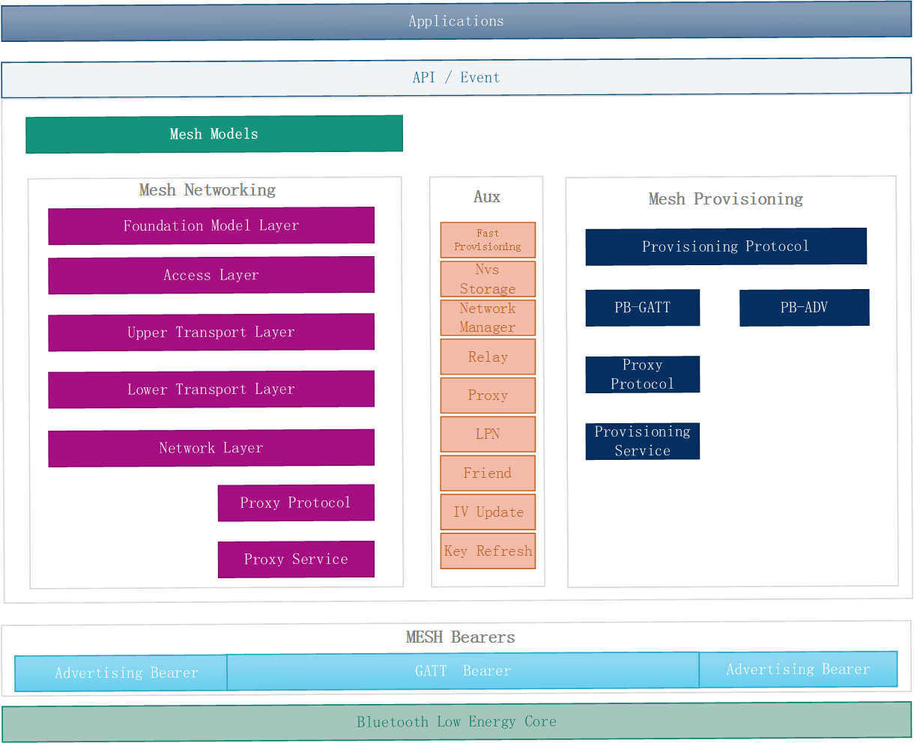

# ESP BLE MESH 框架
本文首先对 ESP BLE MESH 协议栈进行了简单的介绍，然后介绍了协议栈的文件的基本功能，接下来重点分析了协议栈的主体框架，最后描述了协议栈的详细的接口图。

## 协议栈介绍
###  Mesh Networking
蓝牙mesh网络引入了全新的协议栈,这一协议栈建立在低功耗蓝牙技术之上，该协议栈分为7层，其每层的定义如下表所示：

| Layer      | Function |
| --------- | ----- |
| 承载层（bearer layer）  | 承载层定义了如何使用底层低功耗堆栈传输PDU。目前定义了两个承载层：广播承载层（Advertising Bearer）和GATT承载层。 |
| 网络层（network layer） | 网络层定义了各种消息地址类型和网络消息格式。中继和代理行为通过网络层实施。 |
| 底层传输层（lower transport layer）| 在需要之时，底层传输层能够处理PDU的分段和重组。 |
| 上层传输层（upper transport layer）| 负责对接入层进出的应用数据进行加密、解密和认证。它还负责称为“传输控制消息”（transport control messages）这一特殊的消息，包括与“friendship”相关的心跳和消息。 |
| 接入层（access layer）     | 负责应用数据的格式、定义并控制上层传输层中执行的加密和解密过程，并在将数据转发到协议栈之前，验证接收到的数据是否适用于正确的网络和应用。|
| 基础模型（foundation models）| 基础模型层负责实现与mesh网络配置和管理相关的模型。|
| 模型（models）    | 模型层与模型等的实施、以及诸如行为、消息、状态等的实施有关。|

### Provisioning(配置协议): 
配置协议是用来将未配置设备加入到mesh网络中的，该协议分为3层，每层的功能如下表所示：

| Layer     | Function |
| --------- | -------  |
| 承载层（bearer layer）  | 配置协议接收数据包有两个通道，PB-GATT 和 PB-ADV |
| 传输层（Transport layer） | 处理proxy PDU 和 Generic Provisioning PDU |
| 配置协议（ Provisioning Protocol）| 实现对设备进行配置的功能 |

### 辅助程序:
辅助程序设计为用户可选的，不是协议栈的主体，但也十分重要。
* feature
	* friend ：实现朋友特性
	* lpn：实现低功耗特性
	* proxy：实现代理特性
	* relay：实现中继特性

* 网络管理相关程序
	* Mesh Network Creation procedure ：网络创建程序
	* Key Refresh procedure ：秘钥更新程序
	* IV Update procedure ：网络索引更新程序
	* IV Index Recovery procedure：网络索引恢复程序
	* Node Removal procedure：节点移除程序

### 应用层:
* 应用层和协议栈之间通过 `btc_task` 任务进行隔离，`btc_task` 维护了一个队列，用于处理应用层 API 的调用请求和协议栈上报事件请求，`btc_task` 任务会不断的从队列里面获取数据进行处理。
    *  应用层调用 API：用户任务(`user_task`)每调一个 API 会向队列里面发送一个消息，`btc_task` 任务接收到该消息后会调用协议栈的相关函数；当该 API 处理完成后，会向应用层上报 API 调用完成事件。
    * 应用层事件：协议栈向应用层上报一个事件时会向队列里面发送一个消息，`btc_task` 任务接收到该消息后会调用应用层先前注册的回调函数。

API 设计方式是基于事件的，每调用一个API都会有对应的事件触发。
用户使用的API主要操作 `Model Layer` 和 `Provisioning protocol` 相关层提供的函数，并不会跨越协议栈的层进行操作。比如 API 不会调用到 `network layer` 相关的函数。

## 代码结构介绍
代码文件主要从两个角度去实现的：分层思想和模块思想。
* 分层思想：从协议栈描述的层去设计文件，该类型的文件有一个明显的特征就是存在接口函数。
* 模块思想：该文件实现一个独立的功能，供其它程序去调用。

每个源文件的功能如下表所示：

| File | Functionality |
| ------ | ------ |
| `mesh_core/access.c` | BLE Mesh Access Layer |
| `mesh_core/adv.c` | A task used to send BLE Mesh advertising packets and APIs used to allocate adv buffers |
| `mesh_core/beacon.c` | APIs used to handle BLE Mesh Beacons |
| `mesh_core/cfg_cli.c` | Send Configuration Client messages and receive corresponding response messages |
| `mesh_core/cfg_srv.c` | Receive Configuration Client messages and send proper response messages |
| `mesh_core/crypto.c` | Encrypt and decrypt BLE Mesh messages |
| `mesh_core/friend.c` | BLE Mesh Friend functionality |
| `mesh_core/health_cli.c` | Send Health Client messages and receive corresponding response messages |
| `mesh_core/health_srv.c` | Receive Health Client messages and send proper response messages |
| `mesh_core/lpn.c` | BLE Mesh Low Power functionality |
| `mesh_core/mesh_bearer_adapt.c` | BLE Mesh Bearer Layer adapter，This file provides the interfaces used to receive and send BLE Mesh ADV & GATT related packets. |
| `mesh_core/mesh_main.c` | Initialize/enable/disable BLE Mesh |
| `mesh_core/net.c` | BLE Mesh Network Layer, IV Update, Key Refresh |
| `mesh_core/prov.c` | BLE Mesh Node provisioning (PB-ADV & PB-GATT) |
| `mesh_core/provisioner_beacon.c` | BLE Mesh Provisioner receives Unprovisioned Device Beacon and Secure Network Beacon |
| `mesh_core/provisioner_main.c` | BLE Mesh Provisioner manages networking inforamtion, e.g. provisioned nodes, local NetKeys, local AppKeys, etc. |
| `mesh_core/provisioner_prov.c` | BLE Mesh Provisioner provisioning (PB-ADV & PB-GATT) |
| `mesh_core/provisioner/proxy.c` | BLE Mesh Provisioner Proxy related functionalities |
| `mesh_core/proxy.c` | BLE Mesh Node Proxy related functionalities |
| `mesh_core/settings.c` | BLE Mesh Node NVS storage functionality |
| `mesh_core/transport.c` | BLE Mesh Lower/Upper Transport Layer |
| `mesh_models/generic_client.c` | Send BLE Mesh Generic Client messages and receive corresponding response messages |
| `mesh_models/lighting_client.c` | Send BLE Mesh Lighting Client messages and receive corresponding response messages |
| `mesh_models/model_common.c` | BLE Mesh model related operations |
| `mesh_models/sensor_client.c` | Send BLE Mesh Sensor Client messages and receive corresponding response messages |
| `mesh_models/time_scene_client.c` | Send BLE Mesh Time Scene Client messages and receive corresponding response messages |

## 协议栈框架图 

框架图的设计是将 `Mesh Networking` 部分， `Provisioning` 部分和 `API/EVENT` 部分合并到一起。
* Mesh Networking 部分负责设备入网后的消息处理。
* rovisioning 部分负责设备入网前的消息处理。
* API/EVENT 部分负责实现用户想要的功能。

说明：
* 黄色线条表示： API 最终会调用到 `Model Layer`，`Foundation Layer` 和 `Provisioning protocol` 相关的函数，不会干涉到协议栈更下层的行为，也 API 就是不能调用协议栈更下层的函数。
* 紫色线条表示： 消息传输时会经过的相关的层的处理关系。
* `adapt layer` 是 BLE 和 BLE MESH的适配层。`adapt layer` 的主要目的是将 BLE MESH 和 BLE 的代码进行隔离。

## 协议栈详细接口图

接口图详细的描述了每一层对应的实现文件和文件的接口函数，也反应了数据包接收和发送的处理流程。
